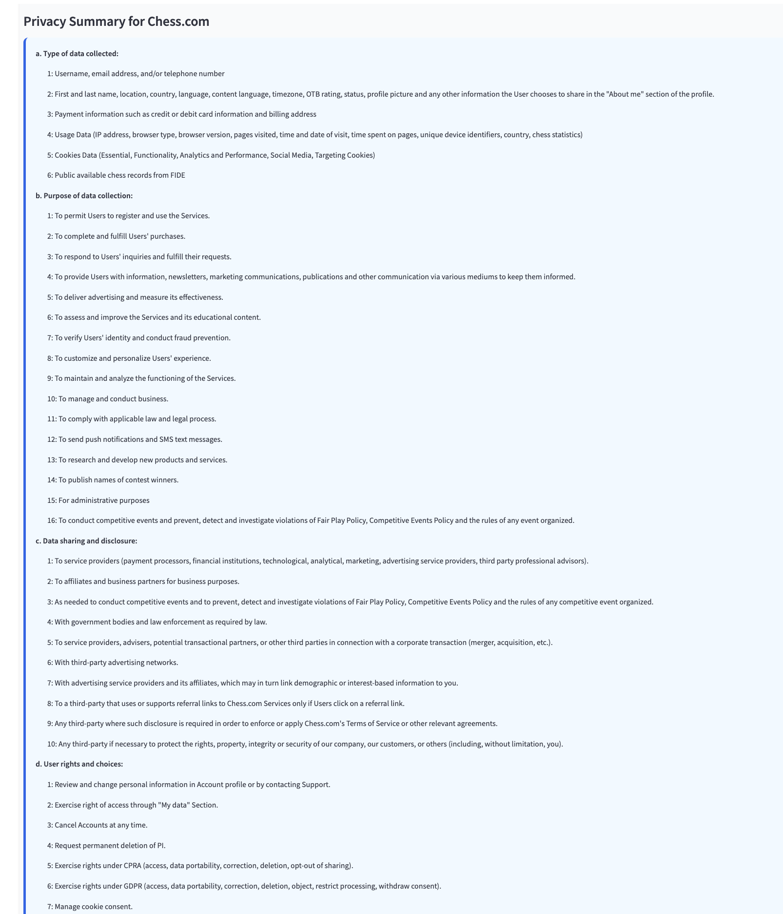

<!-- README.md -->

<h1 align="center" style="color:#4b0082;">ASML Privacy Policy Transparency Project</h1>
<p align="center"><i>In partnership with ASML Lab, Berkman Klein Center</i></p>

---

## 💜 Team Members

<table>
  <thead>
    <tr>
      <th>Name</th>
      <th>GitHub Profile</th>
    </tr>
  </thead>
  <tbody>
    <tr>
      <td>Yilin Qi</td>
      <td><a href="https://github.com/yilinnq">@yilinnq</a></td>
    </tr>
    <tr>
      <td>Grace Guo</td>
      <td><a href="https://github.com/gguo78">@gguo78</a></td>
    </tr>
    <tr>
      <td>Cassie Dai</td>
      <td><a href="https://github.com/cassied22">@cassied22</a></td>
    </tr>
  </tbody>
</table>

---
## 🧰 Setup

- Clone the repo
- Add an `.env` file at the root of the repository containing: `GEMINI_API_KEY=`
- Run `./run.sh` to automatically setup virtual environment & run our app for the following three features: 
  - User Q&A
  - Privacy Policy Summary
  - Policy Comparison Across Platform

---

## 🔧 Individual Functionalities

You can also use each feature separately:

### ❓ User Q&A

**Description**  
A pipeline that:

1. Loads the processed `.txt` version of the policy from the JSON file in `src/data_processing/policy_links`.
2. Loads and chunks the policy document using the HTML version of the .txt file.
3. Builds the index and retrieves relevant sections.
4. Generates the answer using the Gemini API based on a user question.
5. Outputs:
 - the answer,
 - the relevant part of the privacy policy used to generate the answer,
 - the link to the policy on Transparency Hub.

**Instructions**

```bash
cd src/qa
pipenv install
pipenv run python get_txt_policy.py --company_name="you company choice"
```

You can enter a user question directly with:
```bash
cd src/qa
pipenv install
pipenv run python get_txt_policy.py --company_name="you company choice" --question="your question here"
```
Or just run the script and it will prompt you for a question.

**Eligible Company Names**
<details> <summary>Click to view Eligible Company Names</summary>
"blackplanet", "bluesky", "bumble", "cato", "chess", "christian_mingle", "clubhouse",
"coffee_meets_bagel", "eharmony", "feeld", "friendster", "gab", "gettr",
"github", "gofundme", "goodreads", "her", "hinge", "instagram", "jodel", "kickstarter",
"likee", "linkedin", "mastodon", "medium", "meetup", "nextdoor", "okcupid", "parler",
"pinterest", "quora", "raya", "reddit", "sesearch_gate", "signal", "silver_singles",
"slack", "snapchat", "strava", "supernova", "telegram", "tellonym", "threads", "tiktok",
"tinder", "truth_social", "tumblr", "twitter_x", "vanatu", "vero", "whatsapp", "yareny", "youtube"
</details>

<p align="center">
  <figure>
    
    <figcaption align="center"><i>Example for Q&A - Tiktok</i></figcaption>
  </figure>
</p>

<p align="center">
  <figure>
    
    <figcaption align="center"><i>Example for Q&A - Pinterest</i></figcaption>
  </figure>
</p>

###  📊 Policy Comparison
**Description**   
The Policy Comparison feature allows users to analyze and compare privacy policies between two different platforms side by side.

<p align="center">
  <figure>
    
    <figcaption align="center"><i>Feature Interface</i></figcaption>
  </figure>
</p>

**Key Features**
- Side-by-side comparison of privacy policies from different platforms
- Comprehensive analysis across critical privacy aspects:
  - Data collection
  - Data sharing
  - User rights
  - Cookies
  - Third-party data
  - Data retention
  - Security measures
- Hyperlinked citations to source material for verification
- Expandable sections showing original privacy policy excerpts

<p align="center">
  <figure>
    
    <figcaption align="center"><i>Example for Privacy comparison - X vs. Whatsapp</i></figcaption>
  </figure>
</p>

<p align="center">
  <figure>
    
    <figcaption align="center"><i>Reference Example</i></figcaption>
  </figure>
</p>


###  📊 Policy Summary
**Description**   
The Policy Summary feature provides users with a clear, structured overview of a selected platform’s privacy policy. By choosing a platform from the list, users receive a concise summary that highlights the most critical aspects of how their data is handled. 

<p align="center">
  <figure>
    
    <figcaption align="center"><i>Feature Interface</i></figcaption>
  </figure>
</p>

**Key Features**
- Generates a readable, well-structured summary of the selected platform’s privacy policy
- Summary covers essential aspects of data practices, including:
  - Types of data collected
  - Purpose of data collection
  - Data sharing and disclosure:
  - User rights and choices:
  - Data storage and security:
  - Use of cookies and tracking technologies:
  - Other important information (such as children’s privacy, changes to the policy etc.):

- Expandable sections showing original privacy policy excerpts as well as link to the link to the full privacy policy page from the original platform for further reading

<p align="center">
  <figure>
    
    <figcaption align="center"><i>Example for Privacy Summary - chess.com</i></figcaption>
  </figure>
</p>

<p align="center">
  <figure>
    
    <figcaption align="center"><i>Reference of Summary Example</i></figcaption>
  </figure>
</p>
