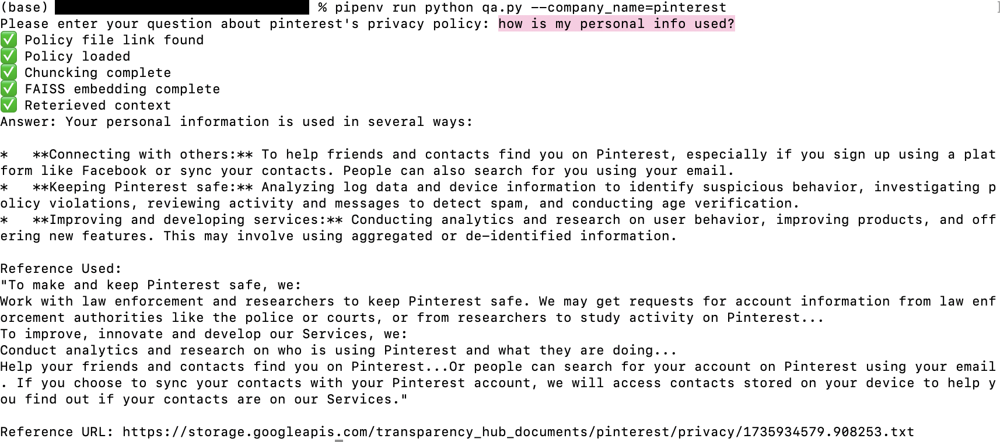

# ASML Privacy Policy Transparency Project

In partnership with ASML Lab, Berkman Klein Center.

## Team Members
| Name         | GitHub Profile                   |
|--------------|----------------------------------|
| Yilin Qi       | [@yilinnq](https://github.com/yilinnq) |
| Grace Guo     | [@gguo78](https://github.com/gguo78) |
| Cassie Dai   | [@cassied22](https://github.com/cassied22) |


##  Functionalities

### User Q&A
- **Description**: A pipeline that:
    1. Loads the processed .txt version of the policy from the JSON file we saved in `src/data_processing/policy_links`.
    2. Loads and chunks the policy document using the html for the .txt file.
    3. Builds the index and retrieves relevant sections.
    4. Generates the answer using the Gemini API given a user question.
    5. Outputs 1) the answer, 2) the relevant part of the privacy policy used to generate the answer, 3) the link to the privacy policy on Transparency Hub.
- **Instructions**
    - cd to `src/qa`
    - run `pipenv install`
    - run `pipnev run python get_txt_policy.py --company_name=` with your specified company name
        - eligible choices: 
            ```
            "blackplanet", "bluesky", "bumble", "cato", "chess", "christian_mingle", "clubhouse",
            "coffee_meets_bagel", "eharmony", "feeld", "friendster", "gab", "gettr",
            "github", "gofundme", "goodreads", "her", "hinge", "instagram", "jodel", "kickstarter",
            "likee", "linkedin", "mastodon", "medium", "meetup", "nextdoor", "okcupid", "parler",
            "pinterest", "quora", "raya", "reddit", "sesearch_gate", "signal", "silver_singles",
            "slack", "snapchat", "strava", "supernova", "telegram", "tellonym", "threads", "tiktok",
            "tinder", "truth_social", "tumblr", "twitter_x", "vanatu", "vero", "whatsapp", "yareny", "youtube"
            ```
    - To enter a user question, you can either pass the question in as an additional argument with `pipnev run python get_txt_policy.py --company_name=xxxx --question=xxxx`, or you can just run `pipnev run python get_txt_policy.py --company_name=` and the script will prompt you for a question.
- **Example**
<p align="center">
  <figure>
    
    <figcaption align="center"><i>Example for Q&A - Tiktok</i></figcaption>
  </figure>
</p>

<p align="center">
  <figure>
    
    <figcaption align="center"><i>Example for Q&A - Pinterest</i></figcaption>
  </figure>
</p>
